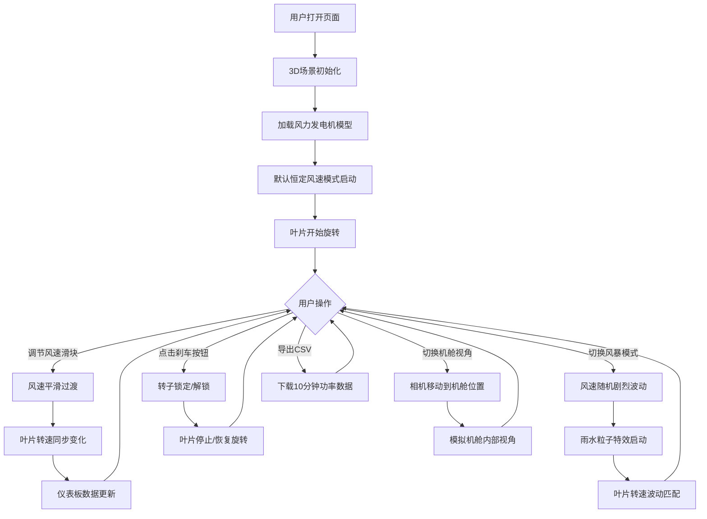

## 1. 产品概述

风力发电机3D仿真系统——一个基于Web的交互式3D风力发电模拟器，通过Three.js构建详细的风力发电机三维场景，配合实时数据仪表板，让用户直观地观察风力发电的全过程。面向新能源教育、演示展示及工程教学场景。

## 2. 核心功能

### 2.1 用户角色

本项目为单页面演示应用，无需用户注册和角色区分。所有功能对所有访问者开放。

### 2.2 功能模块

1. **3D场景主视图**：风力发电机3D模型渲染、场景环境、光照系统
2. **风速控制系统**：风速滑块调节、恒定模式/风暴模式切换
3. **实时数据仪表板**：功率输出、转子转速、累计发电量实时显示
4. **相机控制系统**：默认自由视角与机舱视角切换
5. **故障模拟系统**：刹车按钮锁定转子、故障状态指示
6. **数据导出系统**：CSV格式导出10分钟内功率数据
7. **风向与偏航系统**：风向标模型、机舱偏航对准动画

### 2.3 页面详情

| 页面名称 | 模块名称 | 功能描述 |
|---------|---------|---------|
| 主页面 | 3D场景画布 | 全屏/大面积Three.js渲染区域，展示风力发电机模型、地形、天空环境、风向标、雨水粒子（风暴模式） |
| 主页面 | 数据仪表板 | 侧边/底部面板，显示当前功率(kW)、转子转速(RPM)、累计发电量(kWh)，采用数字+模拟仪表组合 |
| 主页面 | 风速控制面板 | 风速滑块(0-25m/s)、恒定模式/风暴模式切换开关、刹车按钮、导出CSV按钮、相机视角切换按钮 |
| 主页面 | 风向指示器 | 罗盘式风向指示器，显示当前风向角度，与3D场景中风向标同步 |

## 3. 核心流程

## 4. 用户界面设计

### 4.1 设计风格

- **主题**：深色工业科技风（Dark Industrial Tech），暗色背景搭配霓虹绿/青色数据指示
- **主色调**：深灰蓝背景(#0a0e17)，霓虹青(#00e5ff)作为强调色，警示橙(#ff6d00)用于刹车/故障指示
- **辅色**：面板背景半透明深色玻璃效果(#141b2d rgba)，数据数字亮白(#e0e6ff)
- **按钮风格**：圆角矩形，hover时微光效果，激活状态带发光边框
- **字体**：等宽字体(JetBrains Mono)用于数据数字，无衬线字体(Outfit/Inter)用于标签和控制文字
- **布局风格**：左/底部为控制面板区域，中央大面积3D画布，右侧仪表板悬浮叠加
- **动效**：数字变化使用CSS transition平滑过渡，仪表指针动画，按钮hover光效

### 4.2 页面设计概述

| 页面名称 | 模块名称 | UI元素 |
|---------|---------|--------|
| 主页面 | 3D场景画布 | 全窗口画布，天空渐变背景，绿色地形，风力发电机居中偏左，风向标位于右侧高地 |
| 主页面 | 数据仪表板 | 右上角悬浮卡片，半透明深色玻璃材质，三组数据：功率(大号霓虹青数字+环形进度)、转速(中号+单位RPM)、累计发电量(中号+单位kWh) |
| 主页面 | 控制面板 | 底部水平工具栏，圆角卡片，包含：风速滑块(带数值标签)、模式切换(开关式)、刹车按钮(红色警示)、视角切换按钮、CSV导出按钮 |
| 主页面 | 风向指示器 | 3D场景中实体风向标模型 + 仪表板中罗盘图标指示 |

### 4.3 响应式设计

桌面优先设计，适配1920×1080及以上分辨率。移动端通过缩放适配，保持功能完整。

### 4.4 3D场景指导

- **环境**：开阔草地/丘陵地形，白天明亮光照，天空渐变色（浅蓝到白），远处有简易山体轮廓
- **光照**：主方向光（模拟太阳），环境光补光，半球光增加天空/地面反射
- **相机**：默认第三人称环绕视角，支持轨道旋转/缩放；机舱视角切换到机舱前部，向前方观看
- **构图**：风力发电机位于场景中心略偏左，高度占据画面约60%，风向标在右侧
- **交互**：鼠标拖拽旋转场景，滚轮缩放，右键平移；控制面板控制所有参数
- **后处理**：无复杂后处理，保持性能流畅（60fps目标）
- **资源**：全部程序化建模（不依赖外部模型文件），塔筒使用圆柱几何体，叶片使用拉伸/自定义形状，机舱使用BoxGeometry组合
- **性能预算**：总三角面数<50K，粒子数<5000（风暴模式），目标60fps