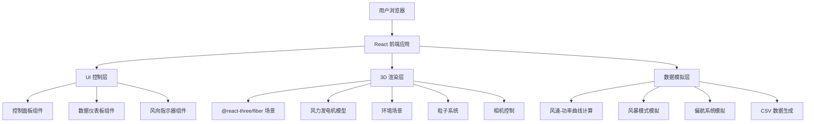
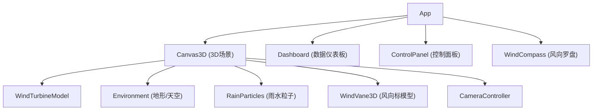

## 1. 架构设计



本项目为纯前端应用，无后端服务。所有数据模拟和计算在客户端完成。

## 2. 技术说明

- **前端框架**：React 18 + TypeScript
- **3D引擎**：@react-three/fiber（React版Three.js）+ @react-three/drei（工具集）
- **构建工具**：Vite 5
- **样式方案**：CSS Modules + CSS变量（深色工业科技风主题）
- **后端**：无（纯客户端模拟）
- **数据持久化**：内存存储（运行期间），CSV导出到本地

## 3. 路由定义

本项目为单页面应用，无路由。

| 路由 | 用途 |
|-----|------|
| / | 主页面，包含3D场景和所有控制面板 |

## 4. 组件树



## 5. 数据模型

### 5.1 核心状态定义

```typescript
interface TurbineState {
  windSpeed: number;          // 当前风速 m/s (0-25)
  targetWindSpeed: number;    // 目标风速（用于平滑过渡）
  rotorSpeed: number;         // 转子转速 RPM
  powerOutput: number;        // 功率输出 kW
  totalEnergy: number;        // 累计发电量 kWh
  windDirection: number;      // 风向角度 (0-360)
  yawAngle: number;           // 机舱偏航角度
  isBrakeEngaged: boolean;    // 刹车状态
  isStormMode: boolean;       // 风暴模式
  isNacelleView: boolean;     // 机舱视角
}

interface PowerDataPoint {
  timestamp: number;          // Unix时间戳
  windSpeed: number;          // 风速 m/s
  powerOutput: number;        // 功率 kW
  rotorSpeed: number;         // 转速 RPM
}
```

### 5.2 风速-功率曲线

采用典型2.5MW风力发电机功率曲线进行模拟：

- 切入风速：3 m/s → 功率 0 kW
- 额定风速：12 m/s → 功率 2500 kW
- 切出风速：25 m/s → 功率 2500 kW（满发后限功率）
- 3-12 m/s区间：功率按三次方关系增长
- 12-25 m/s区间：保持额定功率

## 6. 文件结构

```
src/
├── App.tsx                    # 主应用组件
├── App.css                    # 全局样式
├── main.tsx                   # 入口文件
├── index.css                  # CSS变量和基础样式
├── components/
│   ├── Canvas3D.tsx           # 3D场景容器
│   ├── WindTurbineModel.tsx   # 风力发电机3D模型
│   ├── Environment.tsx        # 地形/天空环境
│   ├── RainParticles.tsx      # 雨水粒子系统
│   ├── WindVane3D.tsx         # 3D风向标
│   ├── CameraController.tsx   # 相机控制
│   ├── Dashboard.tsx          # 数据仪表板
│   ├── ControlPanel.tsx       # 控制面板
│   └── WindCompass.tsx        # 风向罗盘UI
├── hooks/
│   ├── useTurbineSimulation.ts # 风机模拟主逻辑
│   └── usePowerData.ts        # 功率数据记录
├── utils/
│   ├── powerCurve.ts          # 风速-功率曲线计算
│   └── csvExport.ts           # CSV导出工具
└── types/
    └── turbine.ts             # 类型定义
```